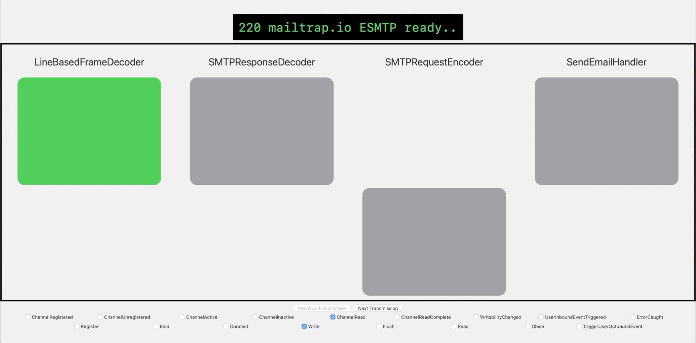

# NIOVisualiser

**NIOVisualiser** enables real-time visualisation of events flowing through the [`SwiftNIO`][repo-nio] [`ChannelPipeline`][cp]

## Prerequisites

- Xcode 11+ (with SwiftUI and Combine)
- MacOS 10.15+

## Overview

In [`SwiftNIO`][repo-nio] events flow through the [`ChannelPipeline`][cp] which is composed of Channel Handlers. 

Each [`ChannelHandler`][ch] is unaware of its position in the [`ChannelPipeline`][cp] and thus, upon receiving an `Event`, uses its [`ChannelHanderlContext`][chc] to send events through the [`ChannelPipeline`][cp]. 

NIOVisualiser mutates the [`ChannelPipeline`][cp] and intersperses Interception Handlers, an implementation of [`ChannelDuplexHandler`][cdh], between existing Channel Handlers.

Information about the placement of each [`ChannelHandler`][ch] is stored by the `Collector`.

Each `InterceptionHandler` has a reference to the `Collector` and notifies the `Collector` upon receiving an `Event`.

The `Collector` predicts the source and destination of each `Event` it is notified of based on its heuristics.  
It then wraps the `Event` along with the `HandlerID` and `ChannelHandlerPort` into a `Message` which is published by the `messagePublisher`, a [`PassThroughSubject`][pts].

The View subscribes to this [`Publisher`][pub] after applying the `transmissionHeuristics` operator which applies heuristics to merge 2 incoming messages into a matched `Transmission` or otherwise emit an unmatched `Transmission` for each message.

The View displays all the Channel Handlers in the [`ChannelPipeline`][cp], except the Interception Handlers, and provides buttons to visualise the flow of events by stepping through each `Transmission`.

The View provides a [`Toggle`][toggle] for each type of `Event` which controls the visibility of that type of `Event`.  

## Components

The NIOVisualiser project contains 4 parts : -  

- NIOAutomation
- NIOVisualiserLibrary
- GUI
- NIOSMTP

### NIOAutomation
NIOAutomation contains 4 parts : - 

- HandlerID (a public struct)
- HandlerIDIterator (a private struct)
- ChannelHandlerInfo (a public struct)
- pipelineAutomation (a function)

The pipelineAutomation function is used to mutate the [`ChannelPipeline`][cp] and notifying the `Collector` of the updates.

Ideally this functionality could be provided by NIO in the future.

### NIOVisualiserLibrary
NIOVisualiserLibrary contains all the business logic that powers the GUI.

### GUI
The GUI is implemented using SwiftUI and utilises the functionality provided by the NIOVisualiserLibrary.

### NIOSMTP
[`NIOSMTP`][niosmtp] is an app that utilises [`SwiftNIO`][repo-nio] to send email using SMTP.  
NIOVisualiser currently intercepts the events flowing through the [`ChannelPipeline`][cp] initialised in this app.  
Ideally NIOVisualiser could itself become a library or package that can be imported into any [`SwiftNIO`][repo-nio] app.

## Caveats
- Provide valid SMTP credentials in `NIOVisualiser/NIOSMTP/Configuration.swift`
- Edit Email in `NIOVisualiser/Main.swift`

[niosmtp]: https://github.com/apple/swift-nio-examples/tree/master/NIOSMTP
[toggle]: https://developer.apple.com/documentation/swiftui/toggle
[pub]: https://developer.apple.com/documentation/combine/publisher
[pts]: https://developer.apple.com/documentation/combine/passthroughsubject
[cdh]: https://apple.github.io/swift-nio/docs/current/NIO/Typealiases.html#/s:3NIO20ChannelDuplexHandlera
[ch]: https://apple.github.io/swift-nio/docs/current/NIO/Protocols/ChannelHandler.html
[chc]: https://apple.github.io/swift-nio/docs/current/NIO/Classes/ChannelHandlerContext.html
[cp]: https://apple.github.io/swift-nio/docs/current/NIO/Classes/ChannelPipeline.html
[repo-nio]: https://github.com/apple/swift-nio